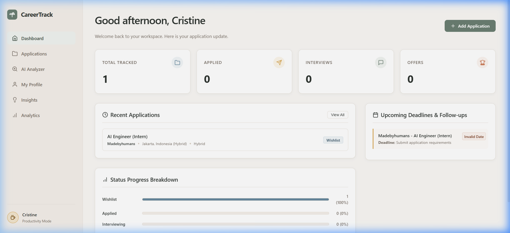
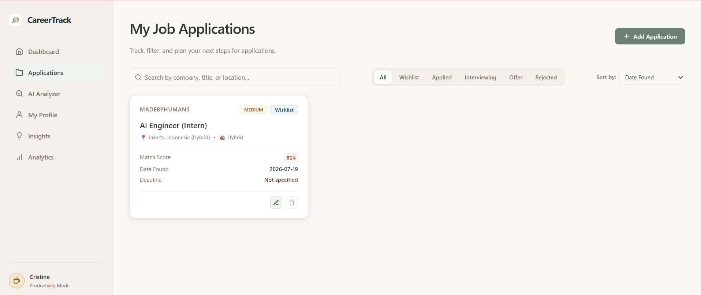
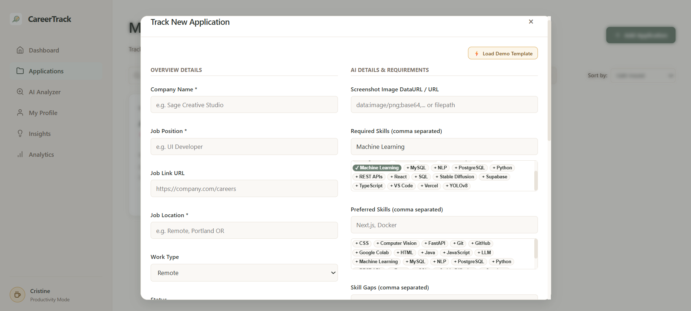
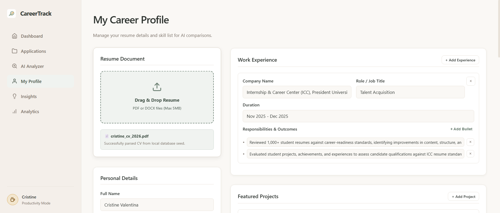

# 🌾 CareerTracker & SkillScope

A cozy, Notion-inspired personal job application tracker combined with an AI-driven skill demand intelligence system. Built to help developers organize their job hunt, upload screenshot postings to extract criteria, and dynamically target their learning schedules using clear, data-driven prioritization formulas.

## 📸 Galeri Tampilan Aplikasi

Berikut adalah tampilan antarmuka dan fitur-fitur utama dari **CareerTracker & SkillScope**:

### 1. Dashboard Utama (Sistem Pemantauan)
Menampilkan ringkasan statistik lamaran kerja, tingkat kecocokan rata-rata, upgrade index skill, dan daftar lamaran dalam status wishlist.


### 2. Tracker Lowongan Kerja (Applications Page)
Daftar seluruh lamaran pekerjaan yang sedang dilacak dengan visual badge status, prioritas, dan dynamic match scoring.


### 3. Formulir Input Lamaran Baru (Requirement Form Modal)
Formulir input lamaran kerja 2-Kolom modern yang diperlebar ke samping untuk menghilangkan scroll vertikal, dilengkapi auto-suggest skill tags.


### 4. Profil Karir & Parser CV AI (My Profile Page)
Halaman profil karir terpadu yang menampilkan data personal, riwayat kerja, riwayat proyek, dan sistem pengunggah CV PDF yang terintegrasi ke Parser AI.


---

## 🛠 Tech Stack

- **Frontend:** React 19, TypeScript, Vanilla CSS (Custom tokens, layout grids, responsive design)
- **Backend:** Python FastAPI, Uvicorn, OpenAI Python SDK, Python-dotenv
- **Database:** Supabase PostgreSQL (Supports direct client calls with local memory/cache hybrid fallback)
- **AI Engine:** OpenAI Chat Completions API with Vision (`gpt-4o-mini`)

---

## 🌟 Key Features

1. **Job Application CRUD Tracker:** Manage companies, titles, links, work arrangements (Remote/Hybrid/Onsite), dates, and priority badges. Includes flexible search, status filters, and sorting.
2. **AI Job Screenshot Analyzer:** Drop image screenshots directly into the browser. The FastAPI backend transmits the files securely to OpenAI to extract overview data and checklists, while integrating a **Graceful Fallback Mode** to guarantee demo availability.
3. **Core Skills Confidence Checklist:** Customize your personal skills inventory and slide your confidence rating (0% to 100%) to indicate your current expertise level.
4. **Deterministic Match Scoring:** Calculates alignment dynamically by evaluating job required skills against your confidence weight, adding a **+15 Points Role Alignment Bonus** if the job title matches your previous experiences.
5. **Data Scientist Skill Upgrade Index:** Highlights missing in-demand skills and ranks them by criticality using active market demands in your tracking history.

---

## 📊 Business Logic Formulas

### 1. Deterministic Match Score
The match percentage is computed locally in the frontend, preventing arbitrary AI guesses:
$$\text{Required Score (80\%)} = \frac{\sum (\text{User\_Confidence\_of\_Matched\_Skills}) + 0.5 \times \sum (\text{Partial\_Matches\_Confidence})}{\text{Total\_Required\_Skills}}$$

$$\text{Preferred Score (20\%)} = \frac{\sum (\text{User\_Confidence\_of\_Preferred\_Matches})}{\text{Total\_Preferred\_Skills}}$$

$$\text{Base Score} = \frac{\text{Required Score} \times 0.8 + \text{Preferred Score} \times 0.2}{\text{Weights\_Sum}} \times 100$$

$$\text{Final Match Score} = \min(100, \text{Base Score} + \text{Experience\_Bonus})$$

### 2. Experience Alignment Bonus (+15 Points)
Scans the job position title and checks it against keywords inside your profile's work experiences list:
- Matches words like `backend`, `frontend`, `fullstack`, `design`, `mobile` in both job title and previous roles.
- Adds **+15 points** if a relevant background match is identified.

### 3. Skill Upgrade Priority Index
Calculates your prioritized learning target list based on active job demand and your weakness:
$$\text{Upgrade Priority Score} = \text{Demand\_Frequency} \times (100 - \text{Your\_Confidence})$$
- **Score $\ge 150$:** `🔴 Critical Action` (High demand, low confidence)
- **$50 \le$ Score $< 150$:** `🟡 Upgrade Recommended`
- **Score $< 50$:** `🟢 Minor Polish`

---

## 💾 Database Schema (Supabase PostgreSQL)

Paste the following SQL DDL statements directly into the **Supabase SQL Editor** to create the required tables:

```sql
-- 1. Create Applications Table
CREATE TABLE IF NOT EXISTS applications (
  id TEXT PRIMARY KEY,
  company TEXT NOT NULL,
  position TEXT NOT NULL,
  job_link TEXT,
  location TEXT NOT NULL,
  work_type TEXT NOT NULL,
  date_found TEXT NOT NULL,
  deadline TEXT,
  date_applied TEXT,
  status TEXT NOT NULL,
  match_score INTEGER NOT NULL,
  follow_up_date TEXT,
  next_action TEXT,
  notes TEXT,
  screenshot TEXT,
  priority TEXT NOT NULL,
  required_skills JSONB,
  preferred_skills JSONB,
  skill_gaps JSONB,
  requirements JSONB,
  responsibilities JSONB,
  benefits JSONB,
  ai_match_score INTEGER
);

-- 2. Create Profiles Table
CREATE TABLE IF NOT EXISTS profiles (
  id TEXT PRIMARY KEY,
  name TEXT NOT NULL,
  email TEXT NOT NULL,
  phone TEXT,
  website TEXT,
  resume_name TEXT,
  resume_status TEXT,
  skills JSONB,
  education JSONB,
  experience JSONB,
  projects JSONB
);

-- 3. Seed Default Profile Data
INSERT INTO profiles (id, name, email, phone, website, resume_name, resume_status, skills, education, experience, projects)
VALUES (
  'cristine',
  'Cristine Valentina',
  'cristine.valentina@student.president.ac.id',
  '+62 898 002 3047',
  'linkedin.com/in/cristine-valentina',
  'cristine_cv_2026.pdf',
  'Successfully parsed CV from local database seed.',
  '[{"name": "JavaScript", "confidence": 95}, {"name": "TypeScript", "confidence": 90}, {"name": "Python", "confidence": 90}, {"name": "Java", "confidence": 75}, {"name": "SQL", "confidence": 85}, {"name": "HTML", "confidence": 95}, {"name": "CSS", "confidence": 90}, {"name": "React", "confidence": 90}, {"name": "FastAPI", "confidence": 90}, {"name": "REST APIs", "confidence": 90}, {"name": "PostgreSQL", "confidence": 85}, {"name": "MySQL", "confidence": 80}, {"name": "Supabase", "confidence": 90}, {"name": "Machine Learning", "confidence": 85}, {"name": "Computer Vision", "confidence": 85}, {"name": "YOLOv8", "confidence": 80}, {"name": "NLP", "confidence": 75}, {"name": "Git", "confidence": 90}, {"name": "GitHub", "confidence": 90}, {"name": "VS Code", "confidence": 95}, {"name": "Google Colab", "confidence": 85}, {"name": "Vercel", "confidence": 85}]'::jsonb,
  '[{"id": "edu-1", "degree": "B.Sc. in Informatics (Artificial Intelligence Concentration)", "school": "President University", "year": "Sep 2024 - Present"}]'::jsonb,
  '[{"id": "exp-1", "company": "Internship & Career Center (ICC), President University", "role": "Talent Acquisition", "duration": "Nov 2025 - Dec 2025", "bullets": ["Reviewed 1,000+ student resumes against career-readiness standards, identifying improvements in content, structure, and presentation for internship and job applications.", "Evaluated student projects, achievements, and experiences to assess candidate qualifications against ICC resume standards."]}]'::jsonb,
  '[{"id": "proj-1", "title": "CAREERTRACK", "role": "Project Owner & Frontend Developer", "tech": ["React", "TypeScript", "FastAPI", "Supabase"], "description": "Developed a responsive personal platform for tracking job applications, recruitment stages, deadlines, follow-ups, and career insights. Built and customized reusable React and TypeScript components."}, {"id": "proj-2", "title": "BRAINFOCUS AI", "role": "Computer Vision Developer", "tech": ["Python", "Computer Vision", "Face Recognition", "Git"], "description": "Developed a facial recognition prototype using collected face datasets. Integrated the computer vision workflow from Google Colab prototype into the web application."}, {"id": "proj-3", "title": "CALORIEVISION", "role": "Backend & Integration Developer", "tech": ["Python", "FastAPI", "YOLOv8", "React", "TypeScript"], "description": "Developed backend logic to automatically aggregate calorie estimates. Integrated YOLOv8 detection outputs for Live Mode and real-time detection results."}, {"id": "proj-4", "title": "PACKWISE AI", "role": "ML Recommendation Developer", "tech": ["Python", "Machine Learning", "Random Forest", "XGBoost", "Supabase"], "description": "Designed a packaging recommendation pipeline and trained Random Forest/XGBoost models. Evaluated recommendation models using accuracy, precision, and recall."}]'::jsonb
) ON CONFLICT (id) DO NOTHING;
```

---

## 🚀 Setup & Installation

### 1. Environment Configurations
Create a `.env` file inside the `backend/` directory with the following variables:
```env
# OpenAI credentials
OPENAI_API_KEY=your_openai_api_key_here
OPENAI_MODEL=gpt-4o-mini

# Supabase Credentials (optional - falls back to local memory if omitted)
SUPABASE_URL=your_supabase_url_here
SUPABASE_KEY=your_supabase_anon_key_here
```

### 2. Launch Backend API (Python)
Navigate to the `backend/` directory and spin up the Uvicorn web server:
```bash
cd backend
pip install -r requirements.txt   # ensure fastapi, uvicorn, supabase are installed
uvicorn main:app --reload
```
The API documentation will be available at `http://127.0.0.1:8000/docs`.

### 3. Launch Frontend Dashboard (React Vite)
Navigate to the root project directory and start the Vite development server:
```bash
npm install
npm run dev
```
Open `http://localhost:5173` in your browser.

---

## 🛡 Hybrid Offline Caching Architecture

This application utilizes a custom **Resilience / Fallback client design**:
- **Offline Mode:** If your FastAPI backend is shut down, the frontend React state automatically saves your entries directly into the browser's `localStorage`.
- **Online Mode:** When the FastAPI server starts, the app performs a lazy initial sync on load to synchronize your dashboard status to Supabase.
- **Security:** The client never stores the OpenAI API key or Supabase Service Role keys in browser JS files. All queries are securely routed via FastAPI endpoints.
